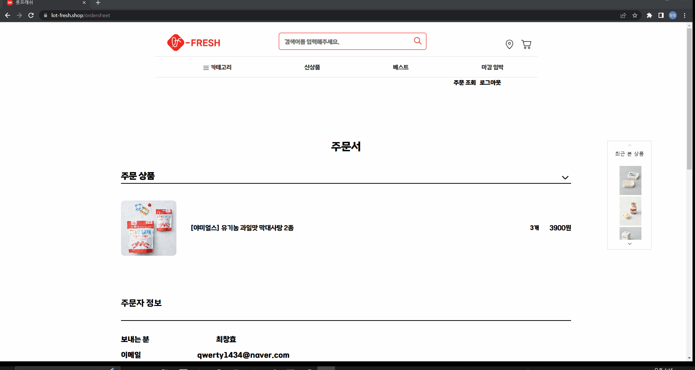
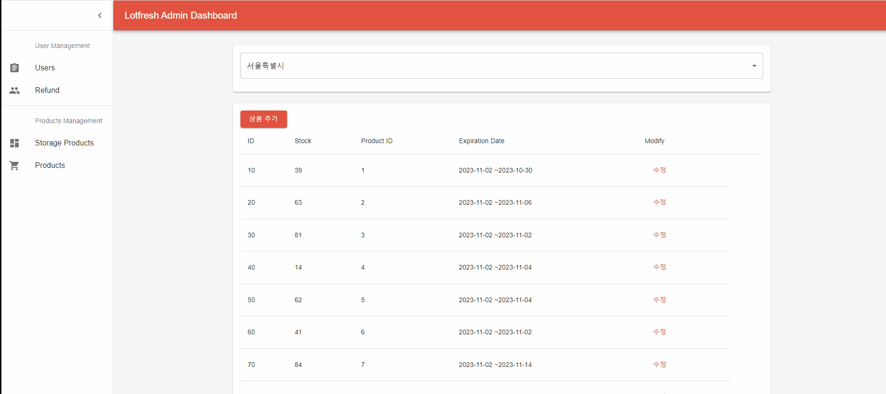
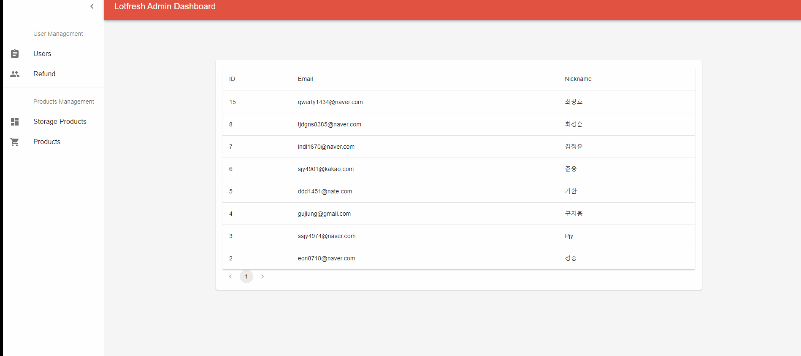
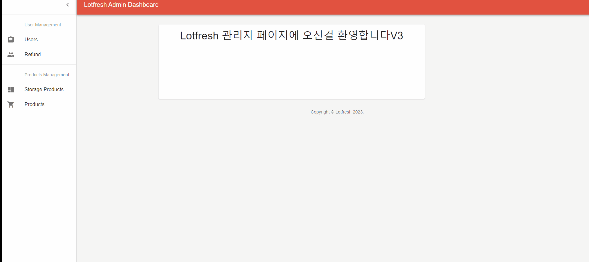

# LotFresh

# 소개

신선식품 전용 쇼핑몰로 상품의 유통기한을 중점적으로 관리하는 시스템

# 기획의도

# 기술스택

- Backend
  - Java
  - SpringBoot
  - JPA
  - Spring Data JPA
  - Spring Security
  - queryDSL
  - openFeign
  - Kafka
- Database
  - MySQL
  - Redis
- Frontend
  - Vue
  - Pinia
  - React
  - TypeScript
- Infra/Server
  - Docker
  - Nginx
  - Eureka Gateway
  - Jenkins
  - AWS

# 시연 연상

# 시스템 아키텍처, CI/CD 다이어그램

## 로그인

  

## 화면 구성

  

## 상품 상세

  

## 장바구니

  

## 구매하기

  

## 상품추가

  

## 재고추가

  

## 회원관리

  

# 포팅 매뉴얼

# 주요 기능

## 유통기한 관리

- 동일한 상품이라도 유통기한에 따라 다르게 취급됩니다
- 48시간 이내 상품은 별도로 판매 및 할인이 적용됩니다
- 스케줄러를 통해 유통기한이 지난 상품이 자동으로 삭제됩니다
- (관리자 페이지에서 유통기한에 따른 기능 추가로 더 있는지)

## 권역별 재고 관리

- 동일한 상품이라도 권역에 따라 다르게 취급됩니다

## 사용자 주소 정보에 따라 맞춤화된 상품 정보 제공

- 자신의 주소와 가까운 지역에 있는 창고의 재고만 주문할 수 있습니다
- 마감 임박 상품은 사용자의 주소에 따라 다르게 표현됩니다
- 일반적인 상품은 사용자의 주소에 따라 남은 수량이 다르게 표현됩니다

# 주요 기술

## MSA환경의 트랜잭션 보장

- '고객의 돈이 빠져나갔는데 다른 요인(ex-재고 부족)으로 구매가 실패하는 상황은 반드시 피하자'는 원칙을 세웠고, 이를 만족시키기 위해 작업에 순서를 부여하고 동기적으로 요청을 진행하는 방식 선택했습니다
- MSA환경에서 분산 트랜잭션의 '결과적 정합성'을 보장하기 위해 SAGA패턴 사용했습니다
- 순차적으로 작업이 진행되어야 했기 때문에 중앙 컨트롤러가 보상 작업을 트리거하는 Orchestration Saga 사용했습니다
- 다른 MSA서비스에게 동기적으로 요청을 보내기 때문에 feignClient를 사용했습니다
- 트랜잭션 실패 시 보상 요청은 순서가 필요하지 않기 때문에 각 MSA서비스에게 비동기적으로 전파합니다
- 장바구니 비우기 요청은 중요하지 않은 작업이라 판단해 트랜잭션에서 제외하고 별도로 요청합니다

### 전체 흐름

QR코드를 요청하는 작업

1. 유저가 주문하기를 클릭한다
2. 주문, 주문 상세정보를 DB에 저장한다
3. Payment에게 요청을 보낸다
4. Kakao로부터 요청을 보내 QR코드 url을 받아온다
5. QR코드 url을 Orchestrator에게 반환한다
6. QR코드 url을 유저에게 반환한다

결제 요청 작업

7. 유저가 QR코드를 이용해 결제 요청을 보낸다
8. Orchestrator는 Inventory에게 재고 차감을 요청한다
9. Inventory는 재고를 확인한 뒤 차감한다
10. 재고 차감에 성공했다는 응답을 Orchestrator에게 보낸다
    - 실패 시 보상 패턴(1) 실행
11. Orchestrator는 Payment에게 결제를 요청한다
12. Payment는 Kakao에게 결제 요청을 보낸 뒤 결과를 반환받는다
13. 결제 테이블의 상태를 변경한다
14. 결제 요청에 성공했다는 응답을 Orchestrator에게 보낸다
    - 실패 시 보상 패턴(2) 실행
15. (장바구니 주문 시) 장바구니 비우기 요청을 보낸다 (트랜잭션에 포함되지 않음)

### 보상 트랜잭션

#### 재고 차감 실패 시 보상 패턴(1)

1. Orchestrator가 Inventory에게 재고 차감을 요청한다
2. Inventory가 재고 차감에 실패한다(ex-재고 수량 부족, 존재하지 않는 상품으로 차감 요청 등등)
3. Inventory는 Orchestrator에게 실패를 반환한다
4. Orchestrator는 Order에게 요청해 주문과 주문상세를 삭제(softDelete)한다

#### 결제 실패 시 보상 패턴(2)

1. Orchestrator는 Inventory에게 재고 차감을 요청하고, Inventory는 성공적으로 재고를 차감했다
2. Orchestrator는 Payment에게 결제를 요청한다
3. Payment가 결제에 실패한다
4. Orchestrator는 Order에게 요청해 주문과 주문상세를 삭제(softDelete)한다
5. Orchestrator는 주문이 실패했다는 내용을 Kafka에 produce한다
6. Inventory는 Kafka를 consume해 주문이 실패했다는 내용을 전달받는다
7. Inventory는 차감했던 재고를 원래대로 복구시킨다

# 역할

|                                                최창효                                                 |                                              구지웅                                               |                                               김성중                                                |                                               선준용                                                |                                                김기환                                                 |
| :---------------------------------------------------------------------------------------------------: | :-----------------------------------------------------------------------------------------------: | :-------------------------------------------------------------------------------------------------: | :-------------------------------------------------------------------------------------------------: | :---------------------------------------------------------------------------------------------------: |
|  |  |  |  |  |
|                                    주문 로직 및 분산 트랜잭션 담당                                    |                                             카트 담당                                             |                                      인프라 및 결제 로직 담당                                       |                                유저, 상품, 카테고리, 할인 로직 담당                                 |                            창고 및 배송 로직 담당   관리자 페이지 담당                             |

# 회고록

## 최창효

MSA아키텍처의 시스템을 설계해볼 수 있어서 좋았습니다. 특히 분산 트랜잭션에 대해 오래 고민하고 직접 설계 및 구현까지 해볼 수 있어서 좋았습니다.

## 구지웅

프로젝트에서 팀원과 조율한 일정을 맞추지 못한 점과 늦어지는 상황으로 팀원과의 의사소통이 부족했던 점이 아쉬웠습니다.

## 김성중

프로젝트 막바지에 서버환경에서 테스트를 동시다발적으로 하다보니 병목현상이 일어나 아쉬웠습니다. 다음번에는 로그 찍는 방식을 체계화하는게 좋겠다고 생각했습니다.

## 선준용

다음 부터는 기획을 좀더 꼼꼼하게 해야겠다고 생각했습니다.

## 김기환

프로젝트에서 맡은 파트의 기획의 구체화를 꼼꼼히 하지 않아 프로젝트 도중에 일이 늘어나고 변경되는 부분이 많았습니다. 다음부턴 기획부터 튼튼히 해야겠다고 느꼈습니다.
